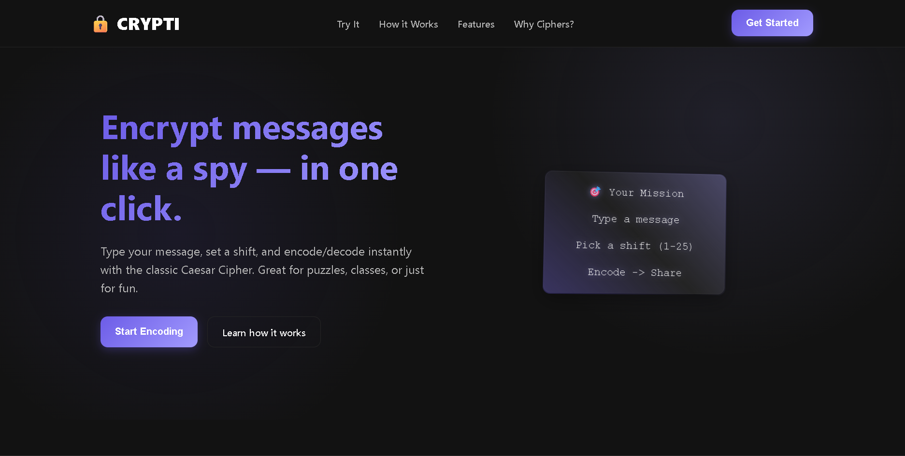
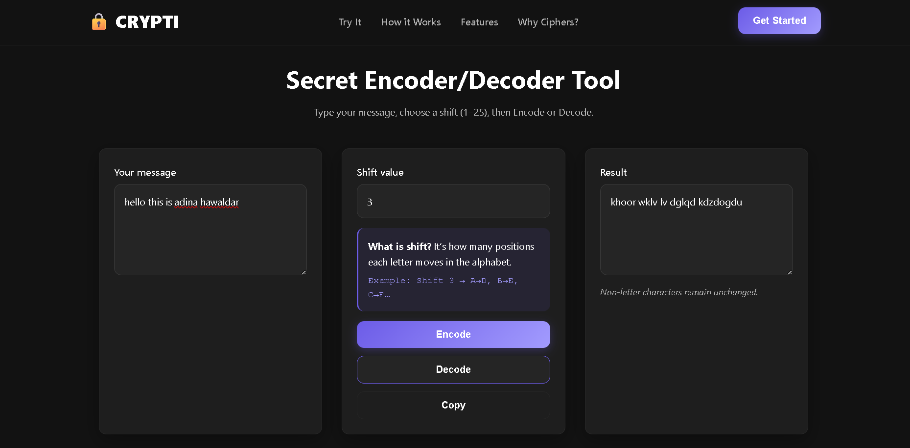

# 🔐 Crypti - Secret Message Encoder/Decoder

Crypti is a fun and interactive web app that lets you **encode and decode secret messages**.  

---

## ✨ Features
- 🔒 Encode text into a secret format  
- 🔓 Decode text back into readable form  
- ⚡ Simple, fast, and lightweight (pure HTML, CSS, and JavaScript)  
- 📱 Responsive design, works across devices  

---

## 📸 Preview

---

## 🛠️ Tech Stack
- **HTML5** – Structure  
- **CSS3** – Styling   
- **JavaScript** – Encoding/Decoding functionality  

---

💡 Project By

👤 Adina Hawaldar

GitHub: @adinahawaldar
